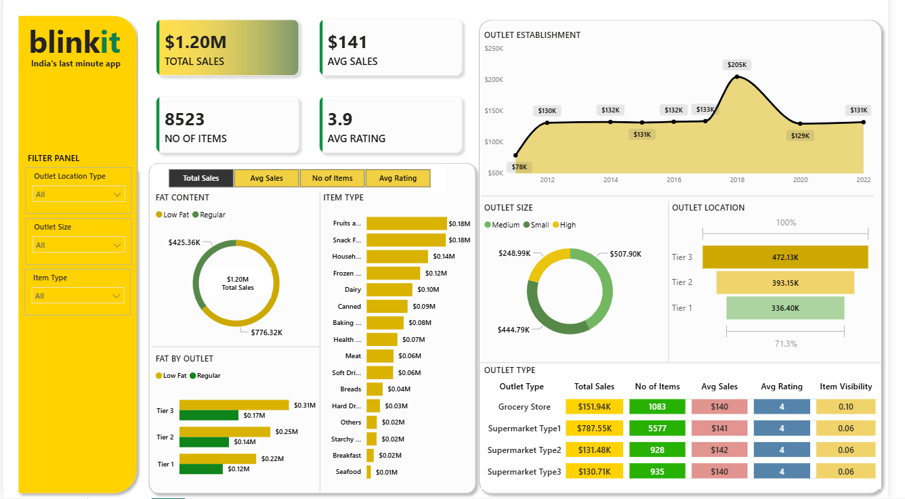

# Blinkit Sales Dashboard | Power BI

## 📌 Project Overview

This project is an interactive *Blinkit Sales Dashboard* built using *Microsoft Power BI*. The dashboard provides insights into Blinkit's sales performance, outlet distribution, product categories, customer ratings, and item visibility. It helps users analyze business performance through interactive visualizations and filters.

---

## 📊 Dashboard Preview

---

## 🎯 Project Objectives

- Analyze overall sales performance.
- Compare sales across different outlet types.
- Understand product category performance.
- Analyze outlet size and location impact on sales.
- Monitor average sales, ratings, and number of items.
- Enable interactive filtering for better business insights.

---

## 📈 Key Performance Indicators (KPIs)

- *Total Sales:* $1.20M
- *Average Sales:* $141
- *Number of Items:* 8,523
- *Average Rating:* 3.9

---

## 📌 Dashboard Features

### Sales Metrics
- Total Sales
- Average Sales
- Number of Items
- Average Rating

### Interactive Filters
- Outlet Location Type
- Outlet Size
- Item Type

### Visualizations
- Outlet Establishment Trend
- Fat Content Distribution
- Item Type Sales Analysis
- Outlet Size Analysis
- Outlet Location Analysis
- Fat Content by Outlet
- Outlet Type Performance Table

---

## 🛠️ Tools Used

- Microsoft Power BI Desktop
- Power Query
- DAX (Data Analysis Expressions)
- Data Modeling

---

## 📂 Files Included

- Blinkit Dashboard.pbix – Power BI project file
- Dashboard_Screenshot.png – Dashboard preview
- Blinkit Grocery Data.xlsx - Excel Data Sheet
- README.md – Project documentation

---

## 📊 Business Insights

- Total sales reached *$1.20M*.
- Supermarket Type 1 generated the highest sales.
- Tier 3 outlets contributed the highest revenue.
- Regular Fat products generated higher sales than Low Fat products.
- Fruits & Vegetables and Snack Foods were the top-selling item categories.
- Medium-sized outlets generated the highest sales.

---

## 🚀 Skills Demonstrated

- Data Cleaning
- Data Modeling
- DAX Measures
- Dashboard Design
- Business Intelligence
- Data Visualization
- Interactive Reporting

---

